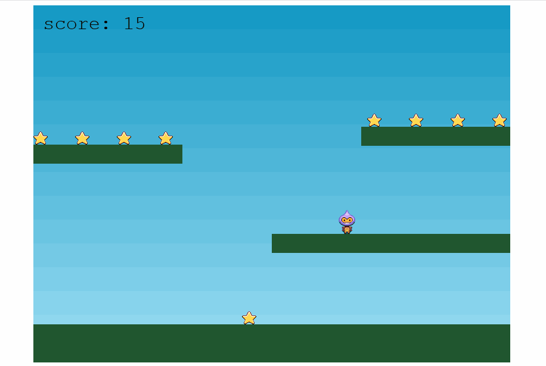

# PROJECT: STAR SHOOTER

 

  

  <h3 align="center">Phaser 3 game</h3>

  

    A simple implementation of a phaser 3 game.
     
    <a href="https://github.com/simandebvu/star-hunter/"><strong>Explore the docs »</strong></a>
     
     
    <a href="https://github.com/simandebvu/star-hunter/issues/">Report Bug</a>
    ·
    <a href="https://github.com/simandebvu/star-hunter/">Request Feature</a>
  

> Phaser is an HTML5 game framework which aims to help developers make powerful, cross-browser HTML5 games really quickly. It was created specifically to harness the benefits of modern browsers, both desktop and mobile. The only browser requirement is the support of the canvas tag.

## Built With

- Javascript
- Node
- Jest
- VSCode
- ESLint
- Stylelint
- Github Actions

## Prerequisites

- Node ^10
- npm ^6
  
## Running Locally

Clone the repo:

`git clone https://github.com/simandebvu/star-hunter.git`

Inside the root folder of the project, install the node packages:

`npm install`

Go to the root folder and run the npm server script:

`npm test`
  
## Authors

👤 **Shingirayi Mandebvu**

- Github: [@simandebvu](https://github.com/simandebvu)
- Twitter: [@simandebvu](https://twitter.com/simandebvu)
- Linkedin: [linkedin](https://linkedin.com/in/simandebvu)

## 🤝 Contributing

Contributions, issues and feature requests are welcome!

Feel free to check the [issues page](issues/).

## Show your support

Give a ⭐️ if you like this project!

## Acknowledgments

- Microverse

## 📝 License

This project is [MIT](lic.url) licensed.
